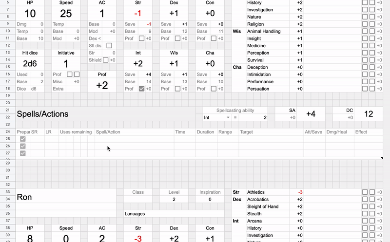
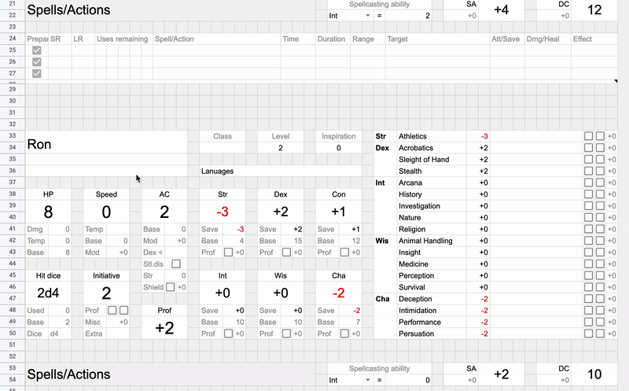
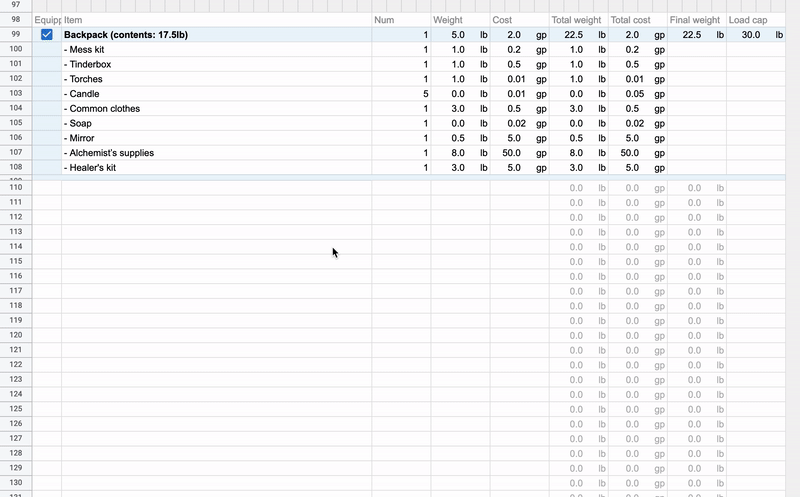
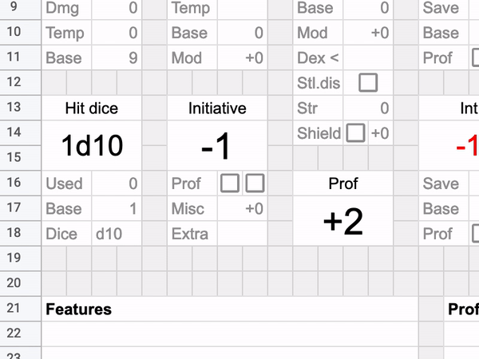
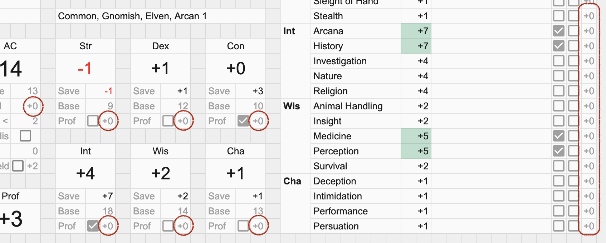

# Intro

There are five sections in the carsheet:

- character stats,
- features and notes,
- spells and actions,
- weapons,
- inventory.

You can move them vertically, copy them, or rearrange them.
You can't move them horizontally.
Since sections contain hidden formulas in columns `C:P`,
you can't copy or move just a part of a section.

**When you copy a section,** it will search for the nearest
character stats section above itself, and use stats from there.
So you can have multiple characters on one sheet
by copying character stats section
and placing additional sections after it.

**When you need to remove a section,**
select its rows and delete them.
This will clear conditional formatting and data validation.

**When you need to add new rows to tables,**
use the "Insert > Rows" menu to insert a row,
then fill the new row with formulas
by selecting a previous row and dragging the selection down
by its bottom-right corner.

**When you configure proficiency,**
and you see two checkboxes,
enabling the left checkbox adds a single proficiency bonus,
enabling the right checkbox adds half of the proficiency bonus,
and enabling both adds a double proficiency bonus.

**When you configure stats,**
there are usually unlabeled cells
with grey numbers near them
that allow adding misc bonuses.

----

[Home](./README.md#docs) • [Next ▷](./02_character_stats.md)
