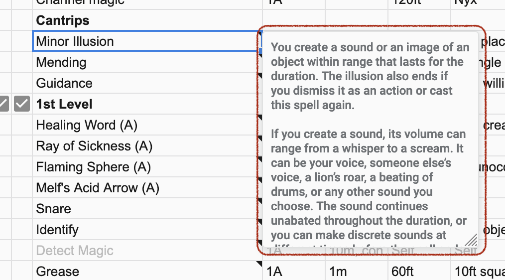

# Spells and actions

This is a table with all
actions, spells, skills, consumable items, etc.
that you can take in or outside of a fight.

Choose your **spellcasting ability**
to calculate **SA** (spell attack bonus)
and **DC** (difficulty class for your spell's save rolls).

## Detailed description of all columns

- **Prepared** column contains checkboxes which indicate
  that the spell or action is available,
  i.e prepared, learned, stored in an inventory.

- **LR, SR** column shows how much uses of a spell
  you regain after a long or a short rest.

- **Uses remaining** column is for tracking used items
  and spells. You can fill it with checkboxes
  and disable a checkbox after you use a spell,
  or you can merge its cells and put a number in them.

- **Spell/Action** column contains name of the spell.
  You can add a cell note with a description of what
  the spell does, so you don't have to google it in game.
  
  

The rest of the columns are used at your discretion.

----

[◁ Previous](./03_features_and_notes.md) • [Home](../README.md) • [Next ▷](./05_weapons.md)
