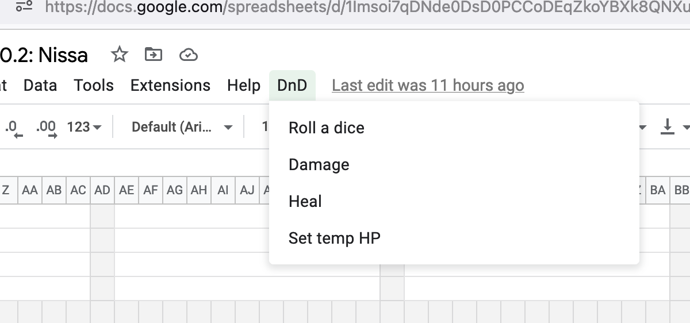
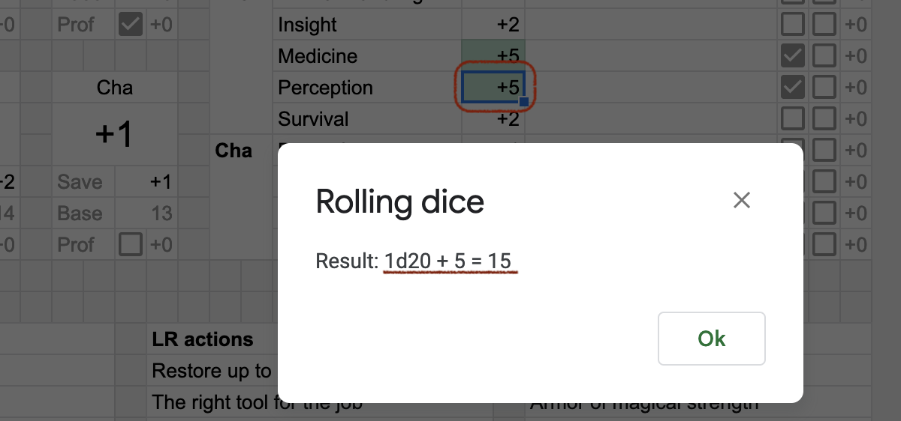
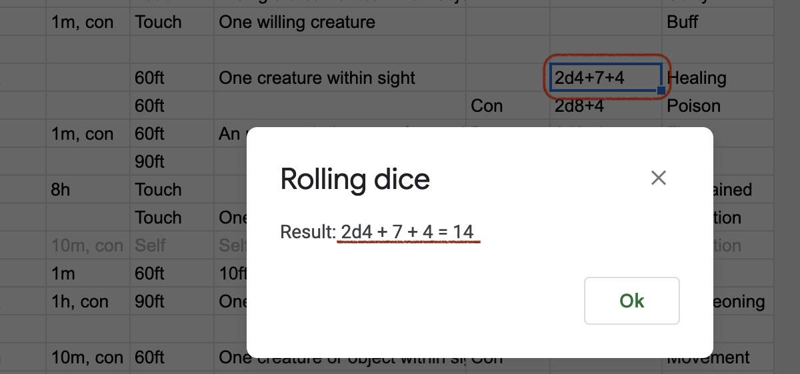
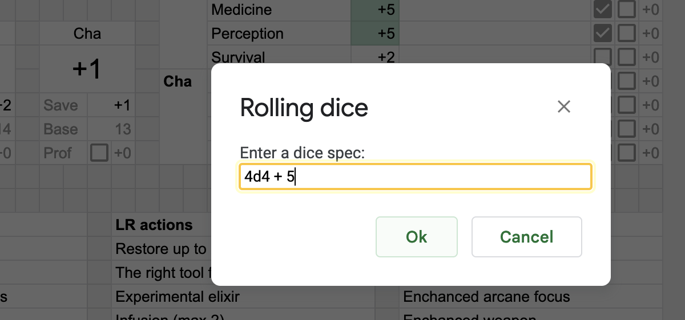
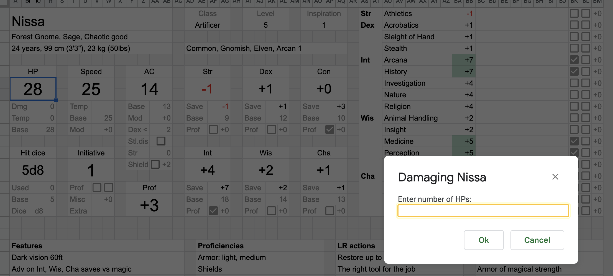

# Scripts

There are a few scripts attached to the file that may speed things up for you.
They are located in the *DnD* menu, and also assigned hotkeys.

On the first run, you'll need to grant them permission to read your charsheet.
We do not collect or store any data.

## Roll a dice

Hotkey: <kbd>Ctrl+Alt+Shift+1</kbd> (<kbd>⌘+⌥+⇧+1</kbd>).

Select a cell with a dice spec and invoke the script.
You'll see a message with the result of the roll.

A dice spec can be a single number, in which case the script rolls a `d20`
with this number as a modifier (and also reports if you've rolled a `20` or a `1`):

Or a dice spec can be a formula containing numbers and dices
(only addition and substraction are supported):

If the dice spec in a selected cell is invalid,
the script will ask you to type in a correct dice spec:

## Damage / Heal

Damage hotkey: <kbd>Ctrl+Alt+Shift+2</kbd> (<kbd>⌘+⌥+⇧+2</kbd>).

Heal hotkey: <kbd>Ctrl+Alt+Shift+3</kbd> (<kbd>⌘+⌥+⇧+3</kbd>).

Select a character that you wish to damage or heal
by selecting a cell in its character stats section
and invoke the script.

You'll be asked to enter the number of HPs to subtract or add:

The HPs are changed with respect to temp HPs assigned to a character.

## Set temp HP

Hotkey: <kbd>Ctrl+Alt+Shift+4</kbd> (<kbd>⌘+⌥+⇧+4</kbd>).

Overrides current temp HP of a character.

Invoked exactly like the *Damage* and *Heal* scripts above.

----

[◁ Previous](./06_inventory.md) • [Home](./README.md#docs) • [Next ▷](./08_aux_sheet_and_formulas.md)
