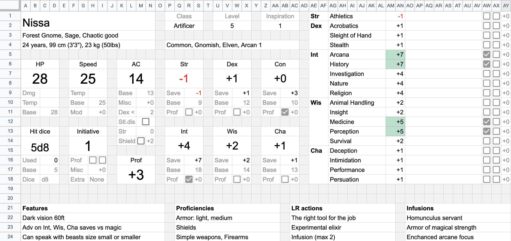

# DnD charsheet

This is a character sheet template made in google sheets, powerful yet flexible.

Current release: [v0.2] (see an [example], my lvl5 artificer Nissa). Make a copy and fill in for your character!

*Note: this is an alpha release. I'm fairly new to DnD, so some functionality may be missing.*
*Please [report any bugs and feature requests] to this repo.*

[v0.2]: https://docs.google.com/spreadsheets/d/1CUvzUhWbFLaV_pfz20NMdJCa-dJ7vRbiKOHLn0vZgXY/edit?usp=sharing
[example]: https://docs.google.com/spreadsheets/d/1Imsoi7qDNde0DsD0PCCoDEqZkoYBXk8QNXubFuE4SnA/edit?usp=sharing
[report any bugs and feature requests]: https://github.com/taminomara/dnd-charsheet/issues

----

----

## Docs

- [Intro and principles](./01_intro.md) to understand basics of this sheet.

- [Character stats](./02_character_stats.md) to get you going with your character.

- [Features and notes](./03_features_and_notes.md) to save arbitrary info about your character.

- [Spells and actions](./04_spells_and_actions.md) to keep track of all actions you can do.

- [Weapons](./05_weapons.md) to keep track of your weapons
  and to automatically calculate their AB and damage. 

- [Inventory](./06_inventory.md) to easily manage your posessions,
  their weight and cost.

- [Scripts](./07_scripts.md) to do scripted actions:
  roll a dice, heal or damage, set temporary HP.

- [Aux sheet and formulas](./08_aux_sheet_and_formulas.md)
  to get deeper understanding of the underlying formulas.

Live long and prosper, in and out of the game 🖖🏽💜🌈
