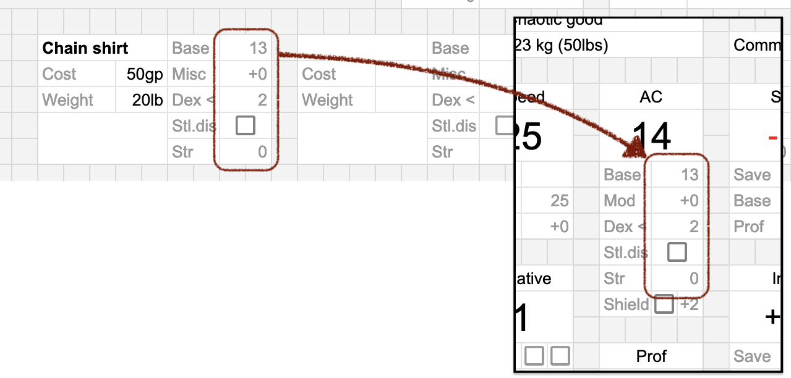

# Inventory

This section contains all the items you cary around.

## Armor slots

Armor slots allow saving stats for armor in your inventory,
and allpying them quickly.

Fill in the stats. To apply them, copy stat values into the *AC* area
of the character stats section.

----

[◁ Previous](./05_weapons.md) • [Home](../README.md) • [Next ▷](./07_scripts.md)
