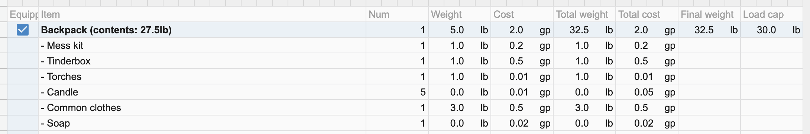
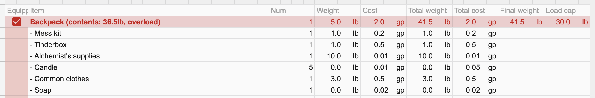

# Inventory

This section contains all the items you cary around.

## Armor slots

Armor slots allow saving stats for armor in your inventory,
and allpying them quickly.

Fill in the stats. To apply them, copy stat values into the *AC* area
of the character stats section.

## Backpack

Backpack is a spetial section of the table.
It tracks weight of all the items inside it,
and reports overweight.

Additionally, a backpack with all of its items can be unequipped,
just toggle a checkbox in the first column.

You can cary multiple backpacks, bags, purses.
Just copy a backpack, possibly rename it,
and set its weight limit at the **Load cap** column.

## Detailed description of all columns

- **Load cap** is how much weight you can cary.
  It is calculated automatically using your strength.

- **Carying** is how much weight you cary right now.

- **GP, SP, CP, etc.** is how much coing you have.

- **Gems** is, well, I needed to fill an empty space.
  Use however you want.

- **Armor slots** — see above.

- **Equipped** contains checkboxes that allows you to unequip a backback.

- **Item** is an item name or description.

- **Num** is how many items you have.

- **Weight** is how much one item weights.

- **Cost** is how much one item costs.

- **Total weight** is the weight of all items you have.

- **Total cost** is the cost of all items you have.

- **Final weight** is the same as *total weight*,
  except it turns to zero whe you unequip a backpack.
  This is the value that goes into the *carying* cell.

- **Load cap** is used to indicate
  how much weight can fit into a backpack.

----

[◁ Previous](./05_weapons.md) • [Home](../README.md) • [Next ▷](./07_scripts.md)
